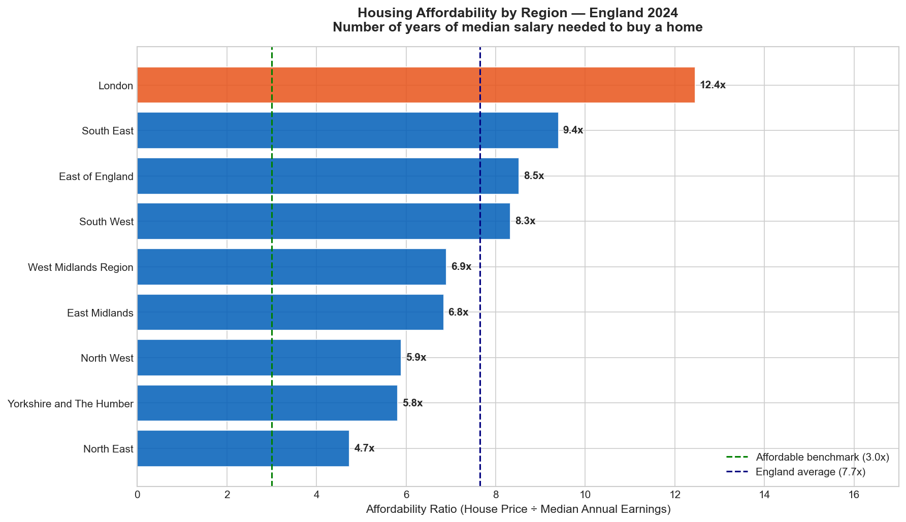
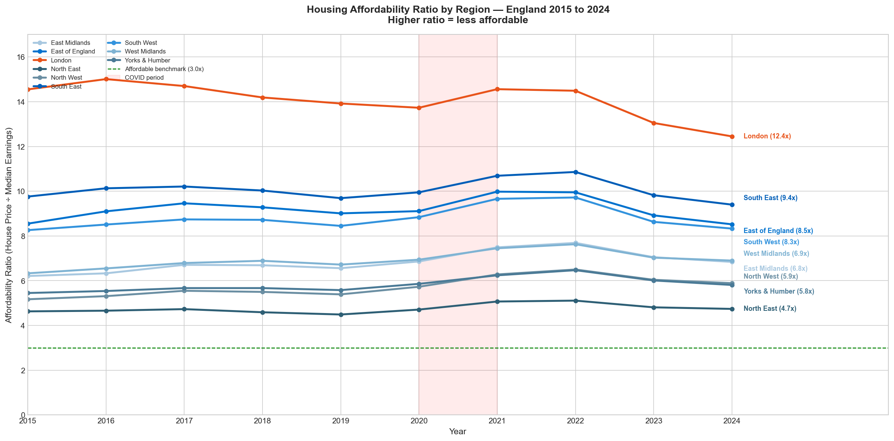
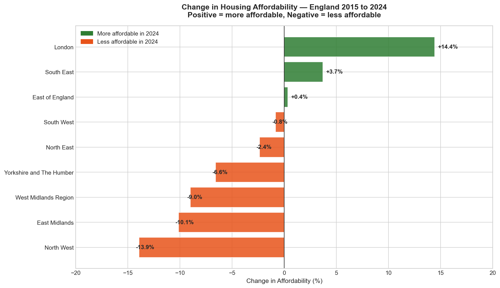
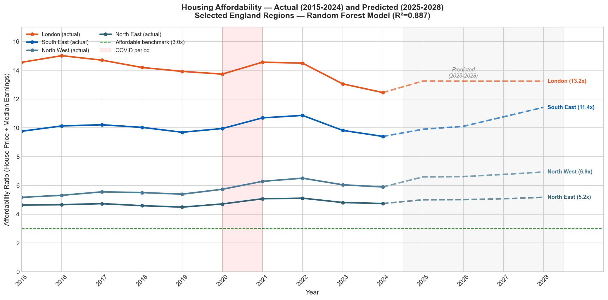

# UK Housing Affordability Analysis

A complete end-to-end data analytics and machine learning project using 
10 years of open government data on house prices and earnings.

---

## The Problem

Housing affordability in England has become one of the most pressing 
domestic policy issues of the decade. This project analyses house price 
and earnings data across 9 English regions from 2015 to 2024 to answer:

- Which regions are most and least affordable right now?
- How has affordability changed over the past 10 years?
- Which regions are deteriorating fastest?
- Where is affordability heading by 2028?

---

## Key Findings

- No region in England meets the internationally recognised affordable 
  benchmark of **3.0x** median annual salary
- The England average affordability ratio is **7.7x** — more than 
  double what is considered affordable
- **London** is the least affordable region at **12.4x** in 2024
- **North East** is the most affordable at **4.7x** — still 57% above 
  the affordable benchmark
- **North West** affordability worsened fastest over 10 years (-13.9%)
- **London** is the only region to improve significantly (+14.4%) as 
  price growth slowed while wages rose
- A Random Forest model predicts the **South East** will reach **11.4x** 
  by 2028 — the fastest deteriorating region going forward

---

## Machine Learning Model

| Metric | Linear Regression | Random Forest (selected) |
|--------|-------------------|---------------------------|
| Test R² | 0.015 | **0.887** |
| Test MAE | 2.024 | **0.670** |
| Training period | 2017–2021 | 2017–2021 |
| Test period | 2022–2024 | 2022–2024 |

Linear Regression failed to capture the relationship between region, 
year and affordability, confirming the data is non-linear. Random 
Forest was selected as the final model and used to project 
affordability ratios to 2028.

---

## Project Structure

    uk-housing-affordability/
    ├── data/
    │   ├── raw/              <- HM Land Registry HPI + ONS ASHE Table 8 files
    │   └── processed/        <- Cleaned merged dataset with affordability ratio
    ├── notebooks/
    │   ├── 01_data_loading.ipynb
    │   ├── 02_exploratory_data_analysis.ipynb
    │   ├── 03_modelling.ipynb
    │   └── 04_conclusions.ipynb
    ├── outputs/
    │   └── charts/           <- 4 publication quality charts
    └── README.md

---

## Charts

### Affordability by Region — 2024

### Affordability Trend — 2015 to 2024

### Change in Affordability — 2015 to 2024

### Forecast — Actual and Predicted to 2028

